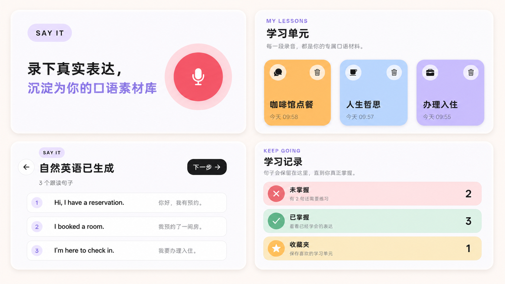

# Say It

> 从你真正想说的话开始，把中文变成自然、日常的美式英语。

Say It 是一款面向日常英语口语学习者的 AI 移动应用。它不从固定教材或陌生例句开始，而是从**用户在真实生活里想表达的内容**开始：先说一段中文，再把它变成自然、地道的美式口语英语。

每一段表达都会沉淀为一个专属学习单元。用户可以逐句听、逐句跟读、标记是否掌握、收藏重要句子，并在之后回到这些来自自己生活的表达中复习。Say It 希望让“我想说什么”先于“我要背什么”，让口语学习更贴近真实场景，也更容易坚持。

当前处于 Android 公开内测阶段。

## 产品效果

从一句中文开始，到可以复习的个人英语表达。

<p align="center">
  
</p>

<p align="center">
  <sub>录下真实表达　·　沉淀为个人口语素材库</sub>
</p>

## 核心体验

1. **说中文**：录制一段中文，支持暂停、继续和最长 60 秒限制。
2. **生成自然英语**：优先生成日常美式口语表达，不使用书面或应试式英语。
3. **逐句学习**：自动拆句，每句可单独播放、跟读和查看中英对照。
4. **检验与记录**：滑动标记已掌握或未掌握，学习记录自动保留。
5. **收藏与复习**：把重要句子收藏到个人收藏夹，后续持续复习。

## 当前功能

- 中文录音、暂停/继续、语音识别与自然英语生成
- 自动拆句、逐句/全文播放、英语发音
- 学习单元保存、删除与卡片式浏览
- 检验模式、已掌握/未掌握记录、收藏夹
- 邮箱注册登录、Supabase 云端学习数据同步
- 首次使用教程与 Android 内测安装包

## 技术架构

| 模块 | 技术 |
| --- | --- |
| 移动端 | React Native、Expo、TypeScript |
| 服务端 | NestJS、TypeScript、Render |
| 数据与账号 | Supabase Auth、PostgreSQL、Storage |
| 语音与 AI | DashScope ASR、Qwen、CosyVoice |

```text
apps/
  mobile/        Expo + React Native 移动端
  api/           NestJS API
packages/
  contracts/     App 与 API 共享的 TypeScript 契约
docs/            PRD、UI 流程、架构与测试记录
evaluation/      AI 模型评测语料、脚本与契约
```

## 内测版本

当前内测构建为 **Say It 1.0.15 (16)**。Android 安装包通过 Expo 内部分发，具体下载链接会随每次构建更新。

## 本地启动

环境要求：Node.js 22+、npm 11+。

```bash
npm install
npm run dev:api
npm run dev:mobile
```

API 健康检查：`GET http://localhost:3000/api/v1/health`

常用验证：

```bash
npm run typecheck
npm run test
npm run build:api
npm run lint --workspace @say-it/mobile
npm run lint --workspace @say-it/api
```

## 隐私与密钥

真实 API Key 仅存放在部署环境或本地 `.env.local`，不会提交到仓库。开发所需变量请参考 `.env.example`。


